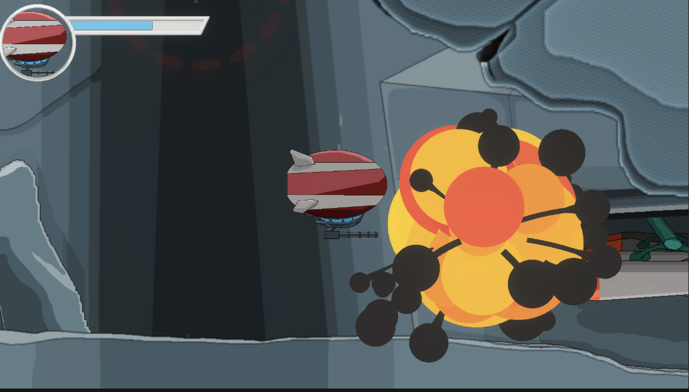
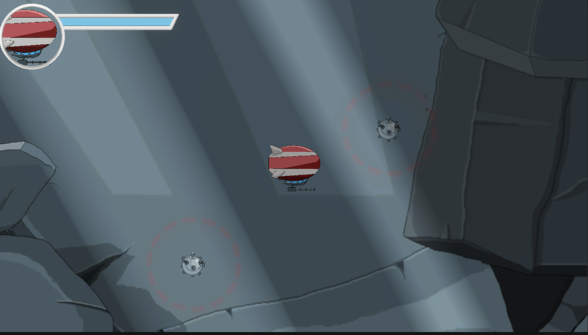
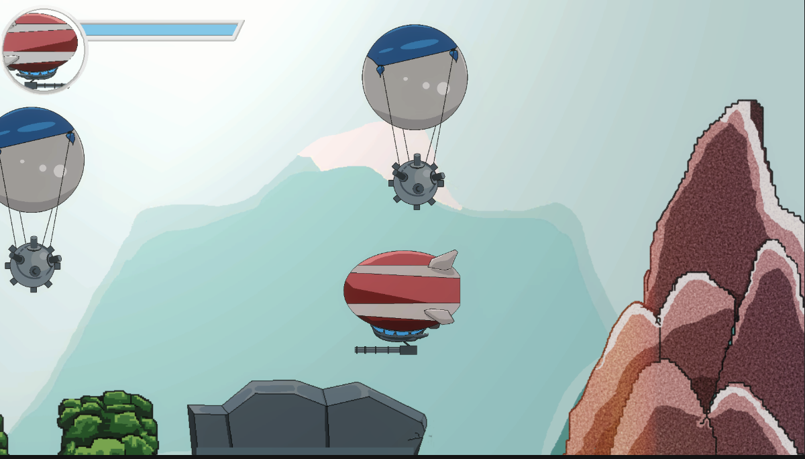
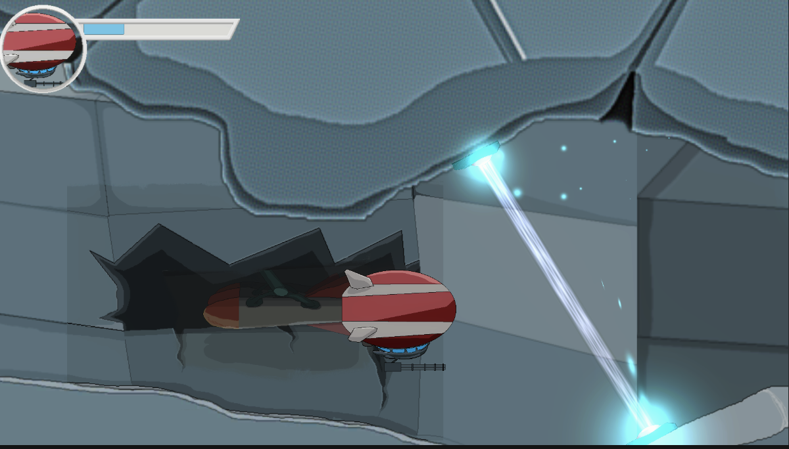
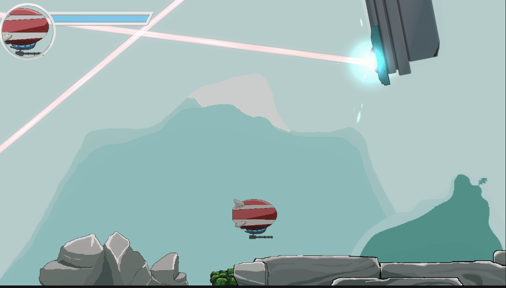
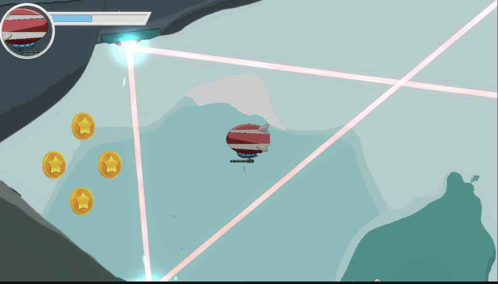
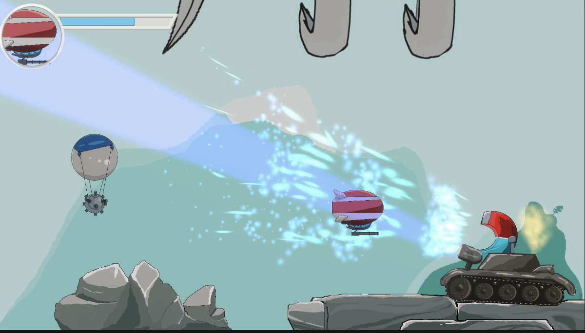
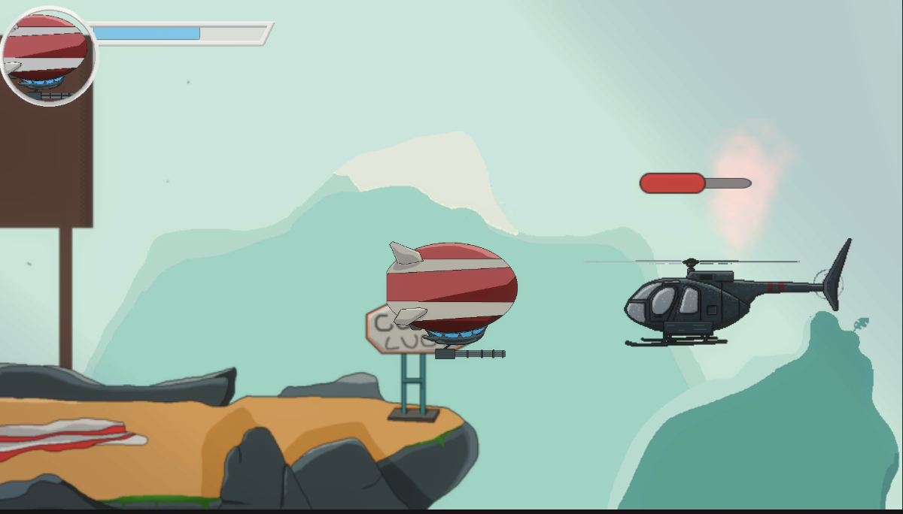

<h1>🎮 2D Airship Platformer (Demo Version)</h1>

This is a demo version of a 2D platformer centered around an airship adventure. The game features dynamic gameplay and visually appealing sprite-based graphics.

<h2>🚀 Key Features:</h2>
<ul>
    <li><strong>Sprite-Based Graphics</strong>  
        
Vibrant 2D visuals and animations.

    </li>
    <li><strong>Diverse AI Mechanics</strong>  
        
Enemies and challenges with various behaviors and strategies.

    </li>
    <li><strong>Explosion Effects</strong>  
        
Stunning visual effects for an immersive experience.

    </li>
    <li><strong>Airship Controls</strong>  
        
Smooth and intuitive control system for piloting the airship.

    </li>
</ul>

<h2>🛠️ Technologies:</h2>
<ul>
    <li>Unity Engine</li>
    <li>2D Physics</li>
    <li>Custom AI System</li>
</ul>

<h2>🌟 Future Plans:</h2>
<ul>
    <li>Add more levels and challenges.</li>
    <li>Introduce power-ups and upgrades for the airship.</li>
    <li>Expand the variety of AI behaviors.</li>
</ul>

Feel free to explore the demo and share your feedback!

## Gameplay

    
    
    
    
    
    
    
    

